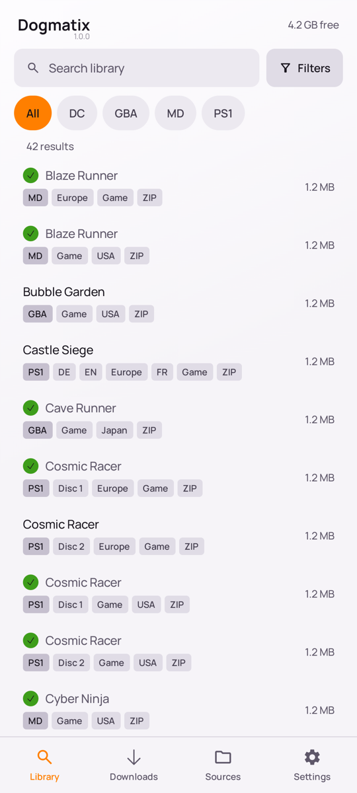
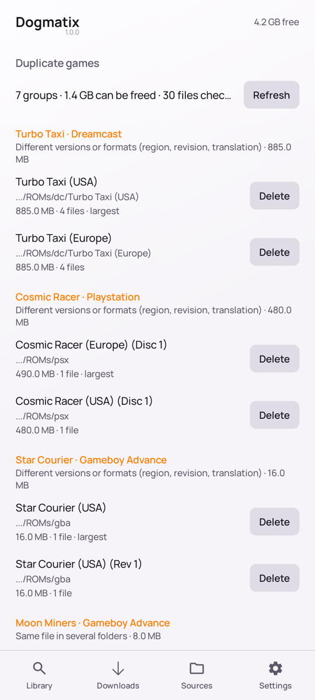
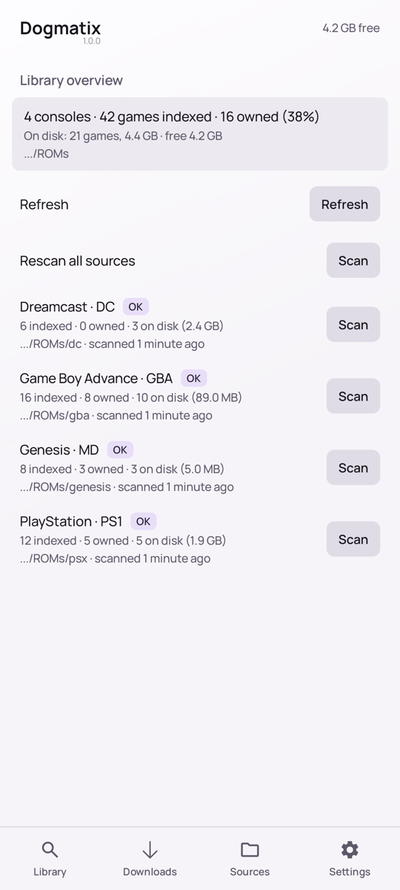
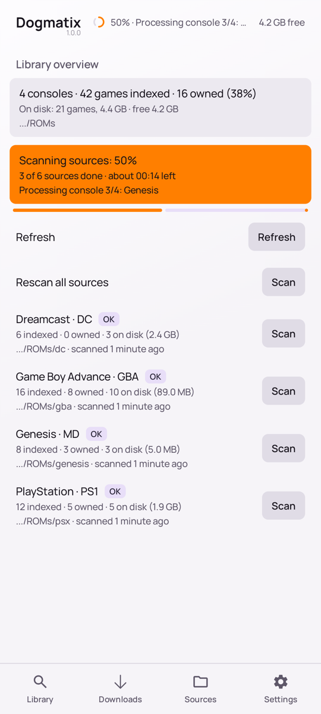
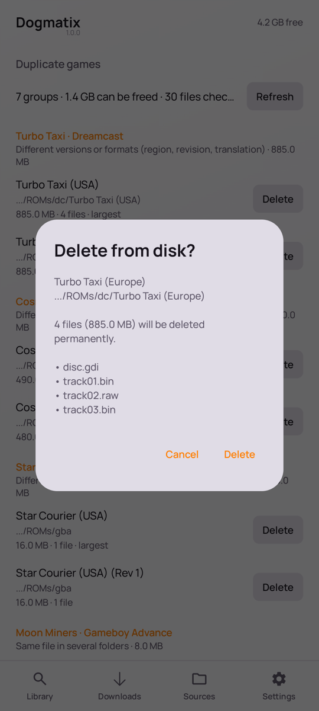
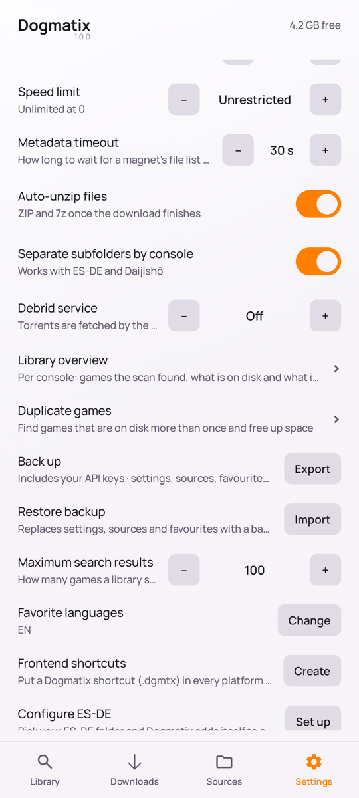
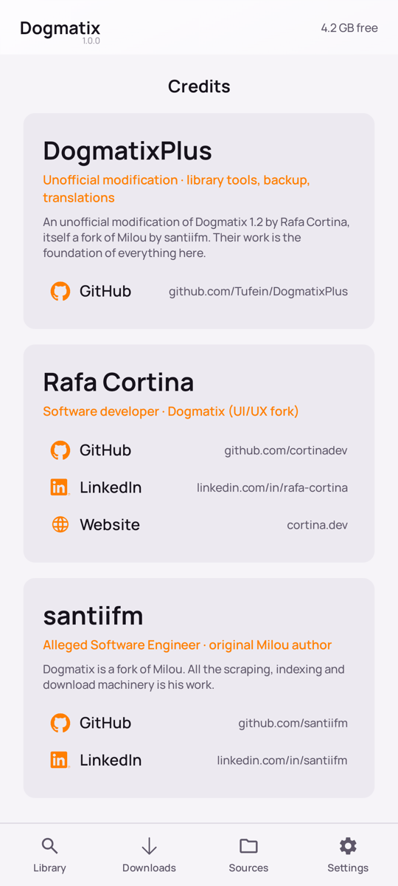
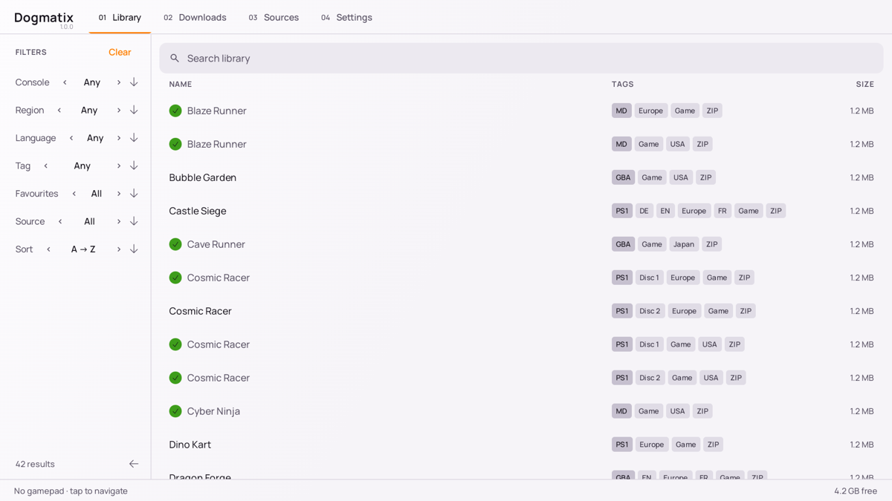
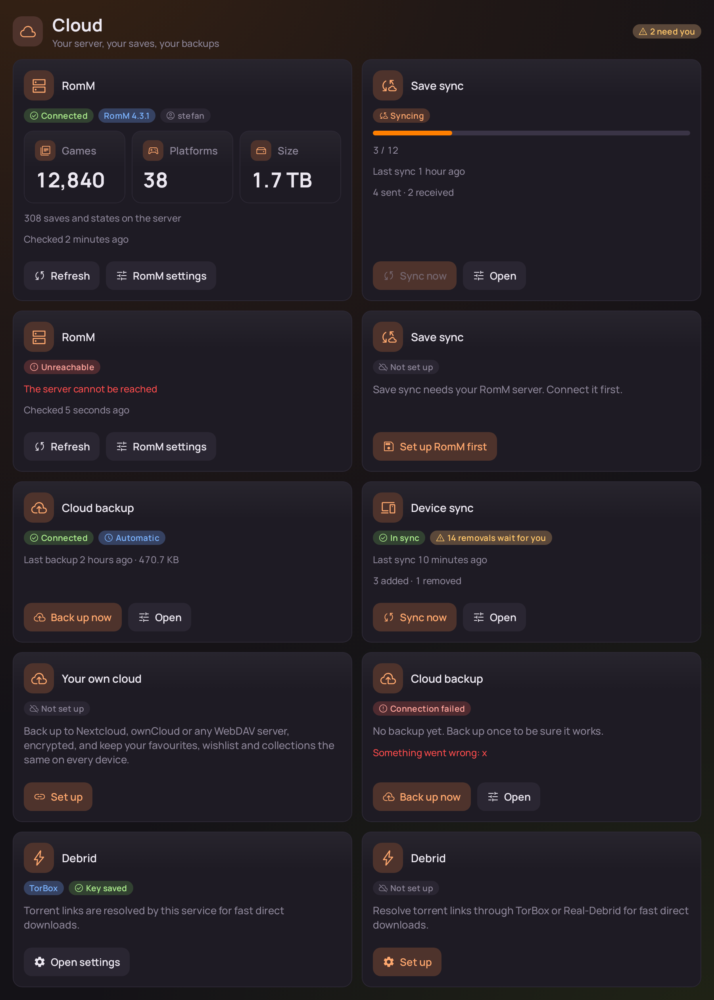

# DogmatixPlus

[English](README.md) · [Nederlands](README.nl.md) · **Français** · [Deutsch](README.de.md) · [Español](README.es.md)

**Trouvez, téléchargez et organisez des jeux rétro sur votre téléphone Android ou votre console portable.**

DogmatixPlus rassemble les jeux des sources que *vous* ajoutez dans une seule grande liste, où l’on peut faire des recherches. Il les télécharge dans les bons dossiers et vous aide à garder votre collection bien rangée. Il fonctionne au toucher *et* avec une manette de jeu. Il est donc à l’aise sur les consoles portables comme les Retroid, Anbernic ou Kinhank.

> **L’application est livrée sans aucun jeu ni lien de téléchargement.** Vous ajoutez vos propres sources, et vous êtes responsable de ne télécharger que ce que vous avez le droit d’avoir.

<table>
  <tr>
    <td align="center" valign="top"> Vos jeux dans une seule liste — un ✓ vert veut dire que vous l’avez déjà</td>
    <td align="center" valign="top"> Trouvez les jeux que vous avez en double</td>
    <td align="center" valign="top"> Voyez votre collection console par console</td>
    <td align="center" valign="top"> Voyez où en est un scan</td>
  </tr>
  <tr>
    <td align="center" valign="top"> Vous voyez toujours quels fichiers vont disparaître</td>
    <td align="center" valign="top"> Les nouveaux outils sont dans les Paramètres</td>
    <td align="center" valign="top"> Les crédits de toutes les personnes impliquées</td>
    <td></td>
  </tr>
</table>

 La nouvelle vue d'ensemble du cloud (titres et chiffres inventés)

*Les captures d’écran utilisent des titres de jeux inventés et des fichiers vides de substitution, et montrent l’application en anglais.*

---

## Que peut faire l’application ?

### Nouveau dans 2.3.0

- Rechercher les téléchargements par titre ou nom, filtrer par état et appliquer des actions aux résultats. Placer la sélection en attente en tête.
- Reprise plus sûre et contrôle des fichiers complets ; les anciens minuteurs ne relancent plus de nouvelles tentatives.

### Nouveau dans 2.2.0
- Vitesse et temps restant par téléchargement, indications fiables pour les tailles inconnues et erreurs avec une action à suivre.
- Toutes les versions sont régulières : 1.0.0, 1.1.0, …, 1.9.0, 2.0.0. [Correspondance des versions](docs/releases/numbering.md).
- Depuis les anciennes versions 8.x, installer une fois [l’APK signée 2.2.0](https://github.com/Tufein/DogmatixPlus/releases/download/v2.2.0/DogmatixPlus-release.apk) manuellement. Les mises à jour suivantes utilisent le numéro de build Android.

### Nouveau dans 1.8.0
- **Une page pour chaque jeu** : A ou un appui dans la bibliothèque ouvre une page plein écran avec l'illustration, un grand bouton Télécharger, la meilleure version, favori, collections, partage et suppression, et des onglets **À propos**, **Versions**, **Progression** (succès, sauvegardes cloud) et **Dans le même genre**. X ou un appui long ouvre toujours la fiche rapide.
- **Menu rapide** : maintenez SELECT pour un anneau avec Rechercher, Tout rechercher, Surprenez-moi, Téléchargements, Tout mettre en pause / Tout reprendre, Outils et Paramètres. Un appui court marque toujours un favori.
- **Stockage intelligent** (facultatif, *Outils → Stockage*) : les consoles auxquelles vous n'avez pas joué depuis un moment et sans favori partent en dossier entier sur la carte SD, et reviennent dès que vous y rejouez. Chaque fichier est copié et vérifié avant que l'original ne parte ; *Vérifier* montre d'abord ce qui serait déplacé. ES-DE suit tout seul, les autres lanceurs doivent être dirigés vers le nouveau dossier à la main.
- **Tout rechercher** : une seule recherche pour les paramètres, les outils, les écrans et vos jeux, depuis le menu rapide, le titre des Outils ou les *Paramètres* ; le paramètre choisi est amené à l'écran et mis en évidence.
- **Mode TV** (*Paramètres → Apparence et commandes*) : texte et lignes plus grands, marges pour les bords du téléviseur et touches de la télécommande ; l'application apparaît aussi dans le lanceur d'Android TV.
- **Le texte des paramètres n'est plus jamais coupé** : titres, explications et valeurs s'affichent en entier.
- Pas encore essayé sur un vrai appareil, un téléviseur ou une carte SD.

### Nouveau dans 1.6.0
- **Garder une collection sur l'appareil** (*Outils → Collections*) : activez-la et les nouveaux jeux qu'elle contient se téléchargent seuls, quelques-uns par passage et seulement s'il y a de la place. Rien n'est supprimé automatiquement ; les jeux sortis de la collection sont proposés dans une liste de contrôle.
- **Libérer de la place** (*Outils*) : jeux jamais lancés, les plus gros d'abord, avec la place gagnée. Favoris, jeux d'une collection, sauvegardes RomM et succès sont protégés. Supprimez-les, ou supprimez et mettez-les sur la liste de souhaits.
- **Descriptions pour votre lanceur** (*Outils*) : écrit description, genre, année et note dans le gamelist.xml d'ES-DE et le metadata.txt de Pegasus, sans toucher à l'existant (une copie de secours est faite d'abord).
- **Meilleurs jeux par console** (*Outils*, avec une clé RetroAchievements) : les jeux les plus aimés, ce que vous avez, et un bouton pour ceux que vous pouvez encore obtenir.
- **Meilleure version disponible** (*Outils*) : une révision plus récente, une version finale au lieu d'une bêta, ou un bon dump au lieu d'un mauvais, pour les jeux que vous avez déjà.
- **Un résumé hebdomadaire** (facultatif), une **tuile des réglages rapides** et des raccourcis du lanceur pour les téléchargements, **votre année en jeux** avec une carte à partager.
- **Le même style sur chaque ligne des paramètres**, et votre propre icône sur le deuxième écran.
- Pas encore essayé sur un vrai appareil ni sur un vrai serveur RomM, WebDAV ou RetroAchievements.

### Nouveau dans 1.5.0
- **Chercher à l'instinct** : filtres de **genre et de décennie** (d'après les infos de jeu déjà là), **Plus comme ça** dans la fiche, **Surprends-moi** sur la touche Start de la manette et une option de **listes compactes**.
- **Objectifs de collection et historique** (*Outils*) : à quel point chaque console est complète, avec les titres manquants prêts à importer, et une chronologie jour par jour de ce que vous avez téléchargé et joué.
- **Partager un jeu** en carte avec sa jaquette, partager la liste de souhaits en texte, et un widget **Reprendre** pour l'écran d'accueil. Un jeu souhaité qui apparaît sur votre serveur RomM est annoncé.
- **Télécharger au bon moment** : seulement en Wi-Fi, en charge, ce soir ou à une heure choisie, par jeu depuis la fiche ou la liste des téléchargements.
- **Une liste de souhaits partagée en famille** sur votre propre serveur WebDAV, avec qui a ajouté et qui a trouvé chaque jeu ; la synchro et la sauvegarde WebDAV sont plus sûres (pas de fichier à moitié écrit, pas de version plus récente écrasée, avertissement pour les adresses non chiffrées).
- **Tout vérifier** (*Outils*) : un rapport sur les sources, le stockage, le BIOS, RomM, les sauvegardes, les notifications et la batterie, avec une solution par problème.
- Pas encore essayé sur un vrai appareil ni sur un vrai serveur RomM ou WebDAV.

### Nouveau dans 1.4.0
- **Un nouveau visuel** : des panneaux avec de la profondeur, une douce lueur dans votre couleur d'accent, des couleurs par console, un focus visible depuis le canapé, des **jaquettes** (RomM, boxart libretro ou une tuile colorée), des graphiques, de nouvelles icônes et des animations calmes. Les réglages des animations, de la lueur et des jaquettes dans la liste sont dans *Paramètres → Apparence et commandes*. La disposition et les boutons ne changent pas.
- **Vue d'ensemble du cloud** (*Paramètres → Cloud*) : RomM, synchro des sauvegardes, sauvegarde cloud, synchro des appareils, RetroAchievements et Debrid sur un seul écran, avec un petit **nuage dans la barre du haut** qui indique repos, synchro en cours ou « a besoin de vous ».
- **RomM sur chaque jeu** : résumé, genres, note et captures dans la fiche, votre **statut de jeu et votre note** renvoyés à RomM, **favoris synchronisés avec RomM** et **fichiers BIOS récupérés sur RomM** (vérifiés par MD5).
- **Sauvegardes cloud par jeu** : les sauvegardes et états du serveur (avec la capture de l'état) à côté des copies de sécurité de l'appareil, avec **Restaurer**, et une rangée **Reprendre** sur l'accueil.
- **Votre propre cloud (WebDAV)** : une **sauvegarde chiffrée** (AES-256-GCM, votre phrase secrète) vers Nextcloud, ownCloud ou tout serveur WebDAV, automatique et avec restauration, et la **synchro des appareils** pour favoris, liste de souhaits et collections entre vos consoles.
- **Progression RetroAchievements** par jeu (anneau et badges) et votre profil dans la vue d'ensemble.
- Pas encore testé sur un vrai appareil ni avec un vrai serveur RomM, WebDAV ou RetroAchievements.

### Nouveau dans 1.3.0
- **Des sets de console entiers en une fois** : *Tout télécharger* prend jusqu’à 3000 jeux, sans « l’application ne répond pas » pendant ou après le lot. Les grandes files restent fluides, peuvent être **mises en pause**, affichent le **temps restant** et ont des boutons pour toute la file (tout arrêter, relancer les échecs, effacer les terminés).
- **Les téléchargements se gèrent tout seuls** : un téléchargement échoué **réessaie de lui-même**, les téléchargements web peuvent être **mis en pause**, un fichier terminé est **comparé à votre DAT**, et vous recevez **une notification quand la file est terminée**.
- **Importer une liste** (*Outils*) : un fichier texte ou le presse-papiers avec un jeu par ligne. La meilleure version de chaque jeu est téléchargée en une fois, le reste peut aller sur la liste de souhaits. La vérification DAT s’en sert pour les jeux qui vous manquent.
- **Recherches récentes** sous le champ de recherche, **Surprenez-moi** (un jeu au hasard dans la liste) et un réglage de la **taille du texte**.
- **Paramètres et Outils en groupes clairs**, un court **quoi de neuf** après une mise à jour, et une **vérification des frontends** dans les Outils.
- **Jaquettes pour Pegasus et RetroArch** à côté de celles d’ES-DE, une **liste de souhaits qui sait ce que vous avez déjà** (et qui se partage en fichier), **déplacer la bibliothèque** vers un autre stockage, **envoyer ce qui manque à RomM**, et la **synchro des sauvegardes pour les émulateurs autonomes** (DraStic, melonDS, mGBA, Snes9x EX+ et d’autres).

### Nouveau dans 1.2.0
- **Les téléchargements reprennent là où ils s’étaient arrêtés** (stockage plein, appli fermée, redémarrage) et **la file survit à un redémarrage** ; une **limite par serveur** ménage les serveurs stricts. **Réorganisez la file** (▲ ▼, ou **Y** pour en mettre un en tête) et **gardez de l’espace libre** pour que les téléchargements s’arrêtent avant que le stockage soit plein.
- **Liste de souhaits en pilote automatique**, **playlists .m3u** pour les jeux à plusieurs disques, et un **conseiller de stockage** quand « Tout télécharger » ne rentre pas.
- **Jaquettes pour ES-DE** (et le lien ES-DE de Cocoon) après chaque téléchargement, depuis libretro-thumbnails. **Cocoon** : ajoutez Dogmatix+ en tuiles par console, vue enregistrée ou Téléchargements.
- **Badges RetroAchievements**, **profils avec code PIN**, **statistiques** avec ce que vous jouez dans ES-DE, et **vues enregistrées** avec un raccourci dans ES-DE.
- **Vérification des BIOS** pour une vingtaine de systèmes, **patchs IPS / UPS / BPS** depuis l’explorateur de fichiers, et les **liens partagés vers l’appli** vont directement dans le dossier d’une console.
- **Collections RomM** dans les deux sens, **DAT directement depuis Redump**, un **second écran** pour les consoles portables à deux écrans et les télés, une **sauvegarde automatique** hebdomadaire, et une nouvelle icône.

### Nouveau dans 1.1.0
- **Réanalyses plus rapides** : les sources dont la liste n'a pas changé sont ignorées (6 sources de 4 000 jeux : de 18 s à 2 s). Une source en échec garde ses jeux, et une source web peut avoir des **adresses de secours**.
- **Analyse en arrière-plan** (chaque jour, en Wi-Fi, en charge, la nuit) avec une notification quand de nouveaux jeux apparaissent ; les nouveaux jeux ont un badge **Nouveau**, un filtre et un tri *Plus récents d'abord*.
- **Collections** : vos propres listes, à côté des favoris.
- **Tout télécharger** ce qui est affiché, après vérification du nombre, de la taille et de l'espace libre ; au choix seulement la meilleure version de chaque jeu.
- **Mises à jour et DLC Nintendo Switch** : voyez ce qui vous manque et récupérez-le.
- **Vérification DAT** avec No-Intro / Redump : bons dumps, mauvais noms (renommés d'une touche), fichiers inconnus et jeux manquants.
- **La limite de vitesse fonctionne** (ce n'était jamais le cas) pour tous les téléchargements ensemble, torrents compris, au choix sans limite la nuit.
- L'**explorateur de fichiers** renomme, déplace et extrait ; **partagez vos sources en code QR** ; **installez les mises à jour depuis l'app** ; un **widget** d'écran d'accueil ; un **contour de focus épais** pour la télé et les consoles portables.

### Trouver des jeux
- **Une seule liste** avec les jeux de toutes vos sources.
- **Une recherche** qui pardonne les erreurs : les accents, les tirets et les lettres doublées n’ont pas d’importance, donc « yugioh » trouve *Yu-Gi-Oh!*.
- **Filtrez** par console, région, langue et type, et **triez** par nom ou par taille.
- Un **✓** vert marque les jeux que vous avez déjà.
- **★ Favoris** : ajoutez une étoile aux jeux que vous aimez et n’affichez que ceux-là.

### Télécharger des jeux
- Fonctionne avec les **liens directs, les torrents et les liens magnet**.
- **Plusieurs téléchargements à la fois**, avec pause, reprise, possibilité de réessayer et limite de vitesse.
- **Les fichiers ZIP et 7z sont décompressés** pour vous.
- Chaque console a **son propre dossier**. Les dossiers que vous avez déjà (comme `gba` ou `psx`) sont réutilisés, et vous pouvez fusionner deux dossiers qui désignent la même console.
- Votre **liste de téléchargements est conservée** quand vous fermez l’application. Sélectionnez plusieurs téléchargements pour les arrêter, les réessayer ou les supprimer ensemble.
- En option : **TorBox** et **Real-Debrid** — des services payants qui récupèrent les torrents pour vous, de sorte que le téléchargement est un fichier normal et rapide.
- **Seulement en Wi-Fi, seulement en charge ou seulement la nuit** : les nouveaux téléchargements attendent que vos conditions soient remplies et disent ce qu’ils attendent. Une **vérification de somme de contrôle** compare un fichier terminé au hash publié par sa source. Dans la fiche du jeu, **Meilleure version** choisit celle qui vous convient (votre région et langue, pas de démos). Un téléchargement terminé peut être **ouvert** dans un émulateur.

### Garder sa collection bien rangée *(nouveau dans DogmatixPlus)*
- **Jeux en double** : trouve les jeux présents plusieurs fois sur votre appareil, montre combien de place vous gagnez et vous laisse supprimer la copie en trop. Rien n’est supprimé avant que vous ayez vu exactement quels fichiers vont disparaître.
- **Aperçu de la bibliothèque** : pour chaque console, combien de jeux sont indexés, combien vous en possédez, combien sont sur votre appareil et quelle place ils prennent, et la date du dernier scan.
- **Sauvegarder** et **Restaurer une sauvegarde** : enregistrez vos paramètres, vos sources, vos favoris et vos téléchargements dans un seul fichier et restaurez-les plus tard — pratique pour un nouvel appareil.
- **Progression du scan** : un pourcentage et le temps restant pendant que vos sources sont lues. Les sources sont **analysées en parallèle**, c’est rapide.
- **Jeux multi-fichiers** : trouve les images de disque inutilisables (un `.cue` dont la piste a disparu, une playlist qui cite un disque supprimé) et crée des playlists `.m3u` pour les jeux à plusieurs disques.
- **Stockage** : l’espace par console, vos plus gros jeux, et si les téléchargements en attente tiennent encore.
- **Liste de souhaits** : notez les jeux que vous voulez ; un message vous prévient quand l’un apparaît dans vos sources.
- **Exportez** votre collection en tableur (CSV) ou en page web. La recherche de doublons peut aussi **proposer quelle copie garder**.
- **Explorateur de fichiers** : regardez dans vos dossiers, tailles et fichiers de jeu, vérifiez les jeux à plusieurs fichiers, ouvrez ou supprimez des fichiers.
- **Rapport d’analyse** : après une analyse, un seul aperçu des sources en échec et de la raison, avec *Rescanner celles-ci* ; chaque source affiche son dernier résultat.

### Pensé pour les consoles portables
- **Tout contrôler avec une manette** : D-pad, A/B/X/Y et les boutons d’épaule. Les indications à l’écran, en bas, correspondent à votre manette (Xbox, Nintendo ou PlayStation), et vous pouvez inverser les boutons si votre manette les signale à l’envers.
- Affichage **paysage et portrait**, avec un panneau de filtres à côté de la liste sur les grands écrans.
- Thème **clair, sombre ou noir pur** (agréable sur les écrans OLED), **douze couleurs d’accent** et **Material You** (Android 12+ : les couleurs suivent votre fond d’écran).
- **◀ ▶ saute dans la bibliothèque par première lettre**, pratique avec une longue liste et sans écran tactile.

### Compatible avec votre lanceur de jeux
- **ES-DE** et **iiSU** reçoivent une entrée « Search for more games » dans chaque console, configurée avec un seul bouton. **Daijishō** vous montre les quelques valeurs à saisir.

### Compatible avec RomM
- Envoyez les téléchargements terminés vers votre serveur **RomM**, ou utilisez RomM comme source de jeux.
- **Synchro des sauvegardes** : votre serveur RomM garde vos **sauvegardes et états de jeu**. Choisissez les dossiers où votre émulateur enregistre (pour RetroArch : `saves` et `states`) et DogmatixPlus envoie la nouvelle progression et récupère une progression plus récente — d’une autre console portable ou du lecteur web de RomM. Si une sauvegarde a changé des deux côtés, vous choisissez laquelle garder ; une copie remplacée est conservée 30 jours. Cela peut se faire tout seul à l’ouverture de l’application ou au retour d’un jeu (*Paramètres → Synchro des sauvegardes*).
- Les jeux que votre serveur RomM a déjà sont **marqués** dans la bibliothèque. Un serveur maison à **certificat auto-signé** fonctionne une fois son empreinte vérifiée. Un envoi interrompu **reprend** là où il s’est arrêté. Les **jaquettes** de RomM peuvent être récupérées dans ES-DE.
- La synchro des sauvegardes peut tourner **en arrière-plan** toutes les quelques heures et peut aussi **reporter les suppressions** (désactivé par défaut, avec garde-fous). Quand une sauvegarde a changé des deux côtés, vous voyez maintenant les deux heures et tailles.

### Vos sources, à votre façon
- Ajoutez des sources à la main, ou **importez et exportez**-les sous forme de fichier pour les partager entre appareils. L’export emporte maintenant aussi vos **★ favoris**, et l’import les ajoute sur l’autre appareil.
- Un court **guide de premier démarrage** vous aide à choisir votre dossier de ROM et à importer vos sources.

### Langues
- **Anglais, espagnol, néerlandais, français, allemand, italien et portugais** (*Paramètres → Langue*, ou selon la langue de votre téléphone).

---

### Nouveautés de 2.4.0

Choisissez un émulateur installé par console, comparez les versions avec des préférences de langue, région et révision et recherchez dans les actions. Restaurez les jeux retirés ou téléchargez-les depuis l’historique. Les copies gardent leurs chemins d’origine et occupent de l’espace jusqu’au vidage de la corbeille.

## Installation

1. Ouvrez la **[page Releases](https://github.com/Tufein/DogmatixPlus/releases)** sur votre téléphone ou votre console portable, ou téléchargez-y le fichier et copiez-le sur l’appareil.
2. Téléchargez l’un des deux fichiers :
   - **`DogmatixPlus-release.apk`** — *le choix normal.* L’application s’appelle **Dogmatix+** et a son propre nom de paquet : elle s’installe **à côté** du Dogmatix officiel et des anciennes versions de DogmatixPlus, sans rien toucher.
   - **`DogmatixPlus-debug.apk`** — une version de débogage qui s’installe elle aussi à côté de tout le reste.
   - **Vous venez d’un ancien DogmatixPlus ?** Dans l’ancienne application, *Paramètres → Sauvegarder*, puis *Paramètres → Restaurer une sauvegarde* dans Dogmatix+, et relancez une fois la configuration d’ES-DE / iiSU / Daijishō.
3. Ouvrez le fichier et autorisez **« Installer des applications inconnues »** si Android vous le demande.

Il vous faut **Android 10 ou plus récent**. L’application n’est pas sur Google Play.

## Premier démarrage

1. Le guide de bienvenue explique les bases.
2. **Choisissez votre dossier de ROM** — le dossier où vos jeux doivent aller.
3. **Importez vos sources** (un fichier avec vos listes de jeux) — ou passez cette étape et ajoutez des sources plus tard dans l’onglet **Sources**.
4. Ouvrez la **Bibliothèque** et touchez un jeu (ou appuyez sur **A**) pour ouvrir sa page. Choisissez ensuite **Télécharger** ou **Jouer**.

## Utiliser une manette

| Bouton | Ce qu’il fait |
|---|---|
| D-pad | Se déplacer |
| **A** | Choisir / ouvrir la page du jeu ; télécharger ou jouer depuis cette page |
| **B** | Revenir en arrière d’une étape |
| **X** | Infos du jeu |
| **Y** | Rechercher |
| **Select** | Ajouter un jeu aux favoris ou l’en retirer |
| **LB / RB** | Passer des filtres à la liste, et inversement |
| **ZL / ZR** | Section précédente / suivante |
| **R3** | Masquer ou afficher le panneau de filtres |

Tout fonctionne aussi au toucher. Les indications ne s’affichent que lorsqu’une manette est connectée.

## Bon à savoir

- Les jeux retirés vont dans la corbeille. Restaurez ou videz via Outils → Corbeille et récupération. L’espace est libéré après vidage ; l’explorateur de fichiers supprime toujours définitivement.
- **Un fichier de sauvegarde contient vos clés de compte** (TorBox, Real-Debrid, RomM). Gardez-le privé.
- **La fenêtre d’infos du jeu reste vide dans les fichiers proposés au téléchargement ici**, car elle a besoin d’une clé gratuite, fournie par une base de données de jeux et ajoutée lors de la compilation de l’application.
- DogmatixPlus ne cherche pas de jeux tout seul. Il lit seulement les sources que **vous** ajoutez.
- **Toutes les versions publiques sont des versions régulières.** La numérotation suit 1.0.0, 1.1.0, …, 1.9.0, 2.0.0. Voir la [numérotation des versions](docs/releases/numbering.md).
- **Quelque chose ne marche pas ?** *Paramètres → Partager le diagnostic* crée un rapport texte pour un signalement ; jetons, adresses de serveur et liens magnet sont d’abord retirés.

---

## Crédits

DogmatixPlus est une petite couche ajoutée par-dessus deux autres projets. La plus grande partie de ce que vous utilisez tous les jours vient d’eux.

| Projet | Réalisé par | Ce qu’il a apporté |
|---|---|---|
| **[Milou](https://github.com/santiifm/milou)** | [santiifm](https://github.com/santiifm) | L’application d’origine et tout son moteur : lecture des sources, classement des jeux par console / région / langue, recherche, téléchargement et décompression. |
| **[Dogmatix](https://github.com/cortinadev/dogmatix)** | [Rafa Cortina](https://github.com/cortinadev) | La version pour consoles portables : contrôle à la manette, affichage paysage, thèmes, favoris, pause et reprise, le guide de premier démarrage, ES-DE / iiSU / Daijishō, TorBox et Real-Debrid, RomM. |
| **DogmatixPlus** | [Tufein](https://github.com/Tufein) | Recherche de doublons, aperçu de la bibliothèque, sauvegarde et restauration, progression du scan, synchro des sauvegardes avec RomM, vérification des jeux multi-fichiers, aperçu du stockage, liste de souhaits, export, planification des téléchargements, vérification des sommes de contrôle, traductions en néerlandais, français, allemand, italien et portugais, et ces versions. |

DogmatixPlus a été **réalisé avec l’aide de l’IA** : le code, les tests et la documentation ont été écrits avec un assistant IA et vérifiés lors de plusieurs tours de relecture. Les décisions, l’orientation et la publication reviennent à la personne qui s’occupe du projet.

## Avertissement

Cette application est uniquement destinée à un usage éducatif. Il vous incombe de vous assurer que vous avez le droit légal de télécharger tout contenu.

Milou et Dogmatix n’ont pas de licence, donc tous les droits sur leur code restent à leurs auteurs. DogmatixPlus est une modification personnelle non officielle et n’est affilié à aucun des deux projets. Si vous êtes l’un des auteurs d’origine et que vous souhaitez que quelque chose soit modifié ou retiré, merci d’ouvrir une issue.

---

## Pour les développeurs

Les détails techniques — comment l’application est construite, comment la recherche de doublons décide, l’organisation des dossiers, les liens profonds, les technologies utilisées et plus encore — se trouvent dans **[TECHNICAL.md](TECHNICAL.md)**. Voir aussi [FRONTENDS.md](FRONTENDS.md) pour la configuration des lanceurs et [CHANGELOG.md](CHANGELOG.md) pour chaque changement. Le fichier TECHNICAL.md est en anglais.
